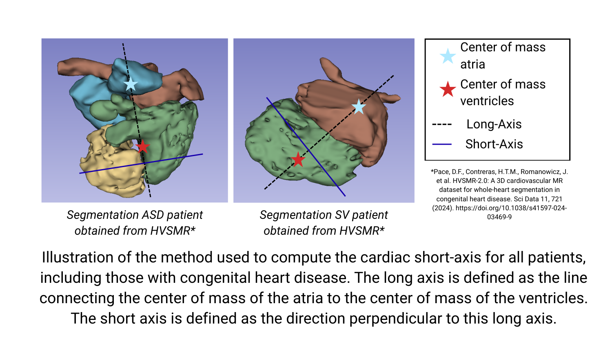

# radial2SA

Reorient a 3D cardiac MRI segmentation (and optionally its image) from any acquisition plane into **short-axis (SA) view**.

---
## Method

The short-axis direction is estimated directly from the segmentation mask, without requiring any manual input:

1. Compute the center of mass of the **atria** (labels 3–4) and **ventricles** (labels 1–2).
2. Define the **cardiac long axis** as the vector joining these two centers.
3. Compute the rotation that aligns this axis with the **Z axis**.
4. Apply the rotation to the segmentation (nearest-neighbor) and optionally to the image (linear interpolation).
5. Save the reoriented volumes with a corrected NIfTI affine.



---
## Usage

```bash
python radial2SA.py --segmentation_path <path> --output_path <path> [--image_path <path>] [--output_filename <name>]
```

`--segmentation_path`: Path to the input segmentation NIfTI file 
`--output_path`: Output directory 
`--image_path`: Path to the corresponding image NIfTI file 
`--output_filename`: Base name for output files (default: `SAX`) 

